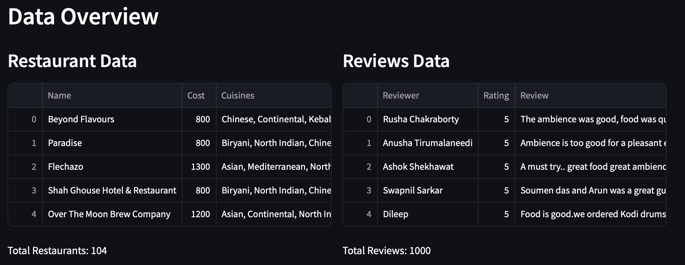
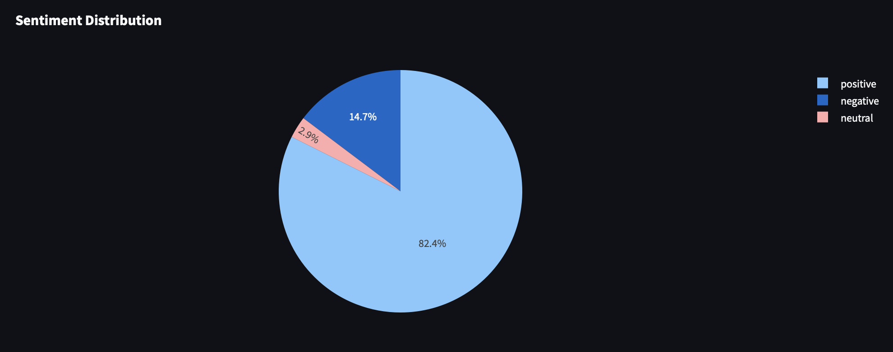
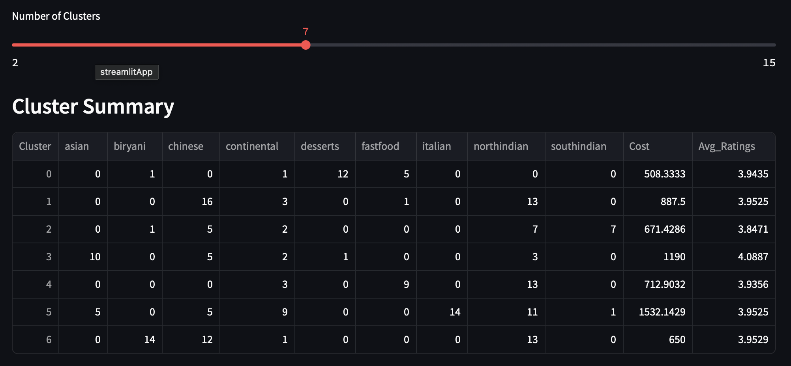

# Zomato Review Sentiment Analysis & Restaurant Clustering


[](https://github.com/shubanborkar/Zomato-Review-Sentiment-Analysis-And-Restaurant-Clustering)
[](https://zomato-review-sentiment-analysis-and-restaurant-clustering.streamlit.app/)

## Project Overview
This project is an interactive **Streamlit dashboard** designed to analyze Zomato restaurant data across Indian cities. It performs **sentiment analysis** on customer reviews to uncover user satisfaction trends and **clusters restaurants** based on cuisines, cost, and ratings using KMeans. The dashboard provides actionable insights for:
- **Customers**: Identify top-rated restaurants based on location, cuisine, or budget.
- **Zomato**: Highlight areas for improvement, optimize offerings, and understand market segmentation.

The project was developed as an individual contribution by **Shuban Borkar** for exploring data-driven insights in India's evolving restaurant industry.

## Live Demo
Try the deployed app: [Zomato Dashboard](https://zomato-review-sentiment-analysis-and-restaurant-clustering.streamlit.app/)

## Features
- **Data Overview**:
  - Summarizes restaurant and review data.
  - Visualizes top cuisines, cost distribution, and rating trends (monthly, weekly, hourly) using Plotly.
- **Sentiment Analysis**:
  - Classifies review sentiments (positive, negative, neutral) using TextBlob.
  - Extracts food entities with spaCy to analyze sentiment around specific dishes.
- **Restaurant Clustering**:
  - Groups restaurants into clusters based on cuisines, cost, and average ratings.
  - Displays cluster characteristics via heatmaps, scatter plots, and ratings-to-cost ratios.

## Motivation
India’s restaurant industry is diverse and rapidly growing, with Zomato providing a rich dataset of dining experiences. This project aims to:
- Understand customer preferences through review sentiment.
- Segment restaurants to reveal market trends.
- Provide data-driven recommendations for Zomato and its users.

## Screenshots
Below are key views of the dashboard:

| **Data Overview** | **Sentiment Analysis** | **Clustering** |
|--------------------|-------------------------|----------------|
|  |  |  |

*Note*: To add screenshots, capture images of each tab in the app and place them in the `screenshots/` folder. Update the paths above if filenames differ.

## Installation
To run the app locally, follow these steps:

1. **Clone the repository**:
   ```bash
   git clone https://github.com/shubanborkar/Zomato-Review-Sentiment-Analysis-And-Restaurant-Clustering.git
   cd Zomato-Review-Sentiment-Analysis-And-Restaurant-Clustering
   ```

2. **Set up a virtual environment** (recommended):
   ```bash
   python -m venv venv
   source venv/bin/activate  # On Windows: venv\Scripts\activate
   ```

3. **Install dependencies**:
   ```bash
   pip install -r requirements.txt
   python -m spacy download en_core_web_sm
   ```

4. **Run the app**:
   ```bash
   streamlit run app.py
   ```
   Open `http://localhost:8501` in your browser.

## Data Requirements
The app requires two CSV files:
1. **Names and Metadata.csv** (restaurant data):
   - **Columns**:
     | Column      | Description                              | Example                     |
     |-------------|------------------------------------------|-----------------------------|
     | Name        | Restaurant name                          | "The Spice Route"           |
     | Cost        | Per-person estimated dining cost         | "1,200"                     |
     | Cuisines    | Comma-separated list of cuisines         | "North Indian, Chinese"     |
     | Collections | Zomato category tags (optional, ignored) | "Fine Dining"               |
   - **Notes**: The `Cost` column may include commas (e.g., "1,200"), which are cleaned by the app.

2. **Reviews.csv** (review data):
   - **Columns**:
     | Column      | Description                              | Example                     |
     |-------------|------------------------------------------|-----------------------------|
     | Reviewer    | Name of the reviewer                     | "John Doe"                  |
     | Rating      | Numeric rating (1-5)                     | 4.5                         |
     | Review      | Review text                              | "Great food, slow service"  |
     | Restaurant  | Name of the restaurant                   | "The Spice Route"           |
     | Metadata    | Reviewer metadata                         | "10 Reviews, 50 Followers"  |
     | Time        | Date and time of review                  | "2023-05-15 18:30:00"       |
   - **Notes**: The `Rating` column may contain non-numeric values (e.g., "NEW"), which are coerced to NaN and filled with the mean.

**Sample Data Format**:
- Due to size and sensitivity, full datasets are not included. A sample structure is provided below:
  ```csv
  # Names and Metadata.csv
  Name,Cost,Cuisines
  The Spice Route,1200,"North Indian, Chinese"
  Cafe Delhi,800,"Italian, Continental"

  # Reviews.csv
  Reviewer,Rating,Review,Restaurant,Metadata,Time
  John Doe,4.5,"Great food, slow service","The Spice Route","10 Reviews, 50 Followers","2023-05-15 18:30:00"
  Jane Smith,3.0,"Average experience","Cafe Delhi","5 Reviews, 20 Followers","2023-05-16 12:00:00"
  ```
- Users must provide their own CSVs matching this structure, uploaded via the app’s sidebar.

## Usage Instructions
1. **Launch the App**:
   - Run `streamlit run app.py` and open `http://localhost:8501` or use the deployed app.
2. **Upload Data**:
   - In the sidebar, under "Data Upload & Configuration":
     - Upload `Names and Metadata.csv` and `Reviews.csv`.
     - Adjust the "Max Rows to Process" slider (default: 1000) to balance performance and data coverage.
3. **Apply Filters**:
   - Use sidebar sliders to filter by:
     - **Cost Range**: Select a range (e.g., ₹500–₹2000).
     - **Rating Range**: Select a range (e.g., 3.0–5.0).
     - **Cuisines**: Choose specific cuisines (e.g., North Indian, Italian).
4. **Explore Tabs**:
   - **Data Overview**:
     - View restaurant/review summaries.
     - Analyze visualizations (e.g., top cuisines, cost histogram).
   - **Sentiment Analysis**:
     - Click "Run Sentiment Analysis" to process reviews.
     - View sentiment distribution (pie chart) and food item sentiments (bar/line plot).
   - **Clustering**:
     - Click "Run Clustering" to group restaurants.
     - Adjust the number of clusters (2–15) using the slider.
     - Explore cluster heatmaps, scatter plots, and ratings-to-cost ratios.
5. **Interpret Results**:
   - Use insights to identify high-value restaurants or areas for Zomato to improve.

## Results & Business Insights
Key findings from the analysis:
- **Cluster 1**: Affordable restaurants with high ratings-to-cost ratio, offering diverse cuisines (e.g., desserts, biryani, Chinese). Ideal for budget-conscious customers.
- **Cluster 2**: High-end restaurants with premium pricing, specializing in Italian and Asian cuisines. Targets upscale dining.
- **Cluster 4**: Low-rated, moderate-cost restaurants dominated by biryani and Chinese, suggesting oversaturation or quality issues.
- **Cluster 6**: Low-cost fast food with low ratings, indicating limited customer satisfaction.
- **Sentiment Analysis**:
  - Negative sentiment around food items like chicken highlights quality improvement opportunities.
  - Positive sentiment for taste and experience can be leveraged for marketing.
- **Recommendations**:
  - **For Zomato**: Improve service quality in low-rated clusters, address negative sentiments (e.g., chicken dishes), and encourage diverse cuisine offerings.
  - **For Customers**: Use the dashboard to find high-value restaurants based on ratings, cost, and cuisine preferences.

## Future Work
- Integrate Zomato’s API for real-time data fetching.
- Use advanced NLP models (e.g., BERT) for more accurate sentiment analysis.
- Add support for additional clustering algorithms (e.g., DBSCAN).
- Include a map visualization for restaurant locations.
- Enable data export for filtered results or cluster assignments.

## Dependencies
- **Python**: 3.13
- **Libraries**: Listed in `requirements.txt`
  - `streamlit==1.39.0`
  - `pandas`
  - `plotly`
  - `scikit-learn`
  - `textblob`
  - `spacy`
- **spaCy Model**: `en_core_web_sm`

## Contributing
Contributions are welcome! To contribute:
1. Fork the repository.
2. Create a feature branch (`git checkout -b feature/new-feature`).
3. Commit changes (`git commit -m "Add new feature"`).
4. Push to the branch (`git push origin feature/new-feature`).
5. Open a pull request.

Please report issues or suggest improvements via the [Issues](https://github.com/shubanborkar/Zomato-Review-Sentiment-Analysis-And-Restaurant-Clustering/issues) tab.

## Author
- **Shuban Borkar**
- GitHub: [shubanborkar](https://github.com/shubanborkar)
- Email: [Your email, if you wish to share]

## License
This project is licensed under the MIT License. See the [LICENSE](LICENSE) file for details.